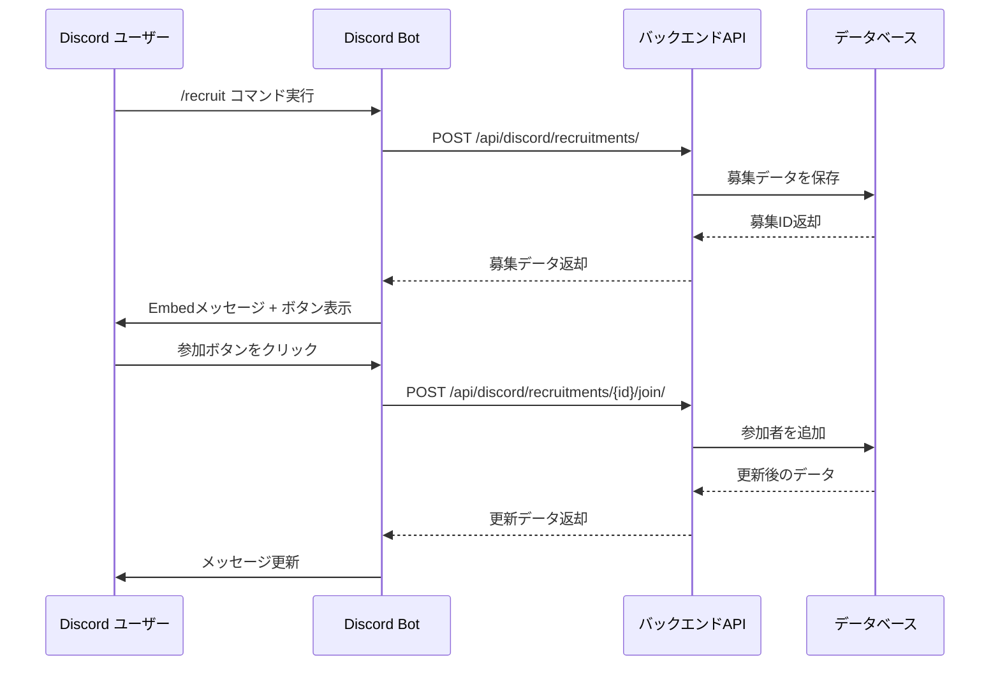

# Discord Bot コード解説

## 📁 ファイル: `backend/discord_bot/bot.py`

このファイルには、Discord Botの全ての機能が実装されています。初学者向けに各部分を詳しく解説します。

---

## 🏗️ コードの構造

### 1. **インポートと設定** (1-30行目)

```python
import discord
from discord import app_commands
from discord.ext import commands
```

- `discord.py`: Discord Botを作るためのライブラリ
- `app_commands`: スラッシュコマンド (`/recruit`) を作るため
- `commands`: Botの基本機能を提供

```python
intents = discord.Intents.default()
intents.message_content = True
intents.members = True
```

**Intents（権限）** とは：
- Bot が Discord で何ができるかを決める設定
- `message_content`: メッセージ内容を読む権限
- `members`: メンバー情報を取得する権限

---

### 2. **RecruitmentView クラス** (33-127行目)

これは **ボタンUI** を作るクラスです。

#### 主な機能：

**✅ 参加ボタン** (`join_button`):
1. ユーザーがボタンをクリック
2. バックエンドAPI (`/api/discord/recruitments/{id}/join/`) にリクエスト
3. 参加成功 → メッセージ更新
4. 失敗 → エラーメッセージ表示

**❌ 退出ボタン** (`leave_button`):
1. ユーザーがボタンをクリック
2. バックエンドAPI (`/api/discord/recruitments/{id}/leave/`) にリクエスト
3. 退出成功 → メッセージ更新

#### 重要なポイント：

```python
@discord.ui.button(label='参加する', style=discord.ButtonStyle.green, emoji='✅')
async def join_button(self, interaction: discord.Interaction, button: discord.ui.Button):
```

- `@discord.ui.button`: ボタンを作るデコレーター
- `interaction`: ユーザーの操作情報
- `async/await`: 非同期処理（複数の処理を同時進行）

---

### 3. **create_recruitment_embed 関数** (130-173行目)

**Embed（埋め込みメッセージ）** を作る関数です。

#### Embedとは？
Discord で見かける、きれいに装飾されたメッセージボックスのことです。

```python
embed = discord.Embed(
    title=f"🎮 {title}",
    description=description,
    color=discord.Color.green()
)
```

#### 表示内容：
- **タイトル**: 募集のタイトル
- **説明**: 募集の詳細
- **参加者リスト**: 現在参加している人の一覧
- **プログレスバー**: 進捗を視覚的に表示 (`███░░░░░░░`)
- **ステータス**: 募集中 or 募集終了

---

### 4. **on_ready イベント** (176-187行目)

Bot が起動したときに実行される関数です。

```python
@bot.event
async def on_ready():
    print(f'✅ Botが起動しました: {bot.user.name}')
    synced = await bot.tree.sync()
```

- `bot.tree.sync()`: スラッシュコマンドをDiscordに登録
- これを実行しないと `/recruit` コマンドが使えません

---

### 5. **/recruit スラッシュコマンド** (190-269行目)

メインの機能です。ユーザーが `/recruit` を実行すると呼ばれます。

#### コマンド定義：

```python
@bot.tree.command(name="recruit", description="パーティ募集を作成します")
@app_commands.describe(
    title="募集のタイトル",
    description="募集の詳細説明",
    max_slots="最大参加人数（デフォルト: 5人）"
)
async def recruit(interaction, title: str, description: str = "", max_slots: int = 5):
```

#### 処理の流れ：

1. **遅延応答**: `await interaction.response.defer()`
   - Discord は3秒以内に応答しないとタイムアウトするため、先に「処理中...」と伝える

2. **バックエンドAPIに募集を登録**:
   ```python
   url = f"{BACKEND_API_URL}/api/discord/recruitments/"
   async with session.post(url, json=data) as response:
   ```

3. **Embedメッセージとボタンを作成**:
   ```python
   embed = create_recruitment_embed(recruitment_data)
   view = RecruitmentView(recruitment_id, max_slots)
   ```

4. **メッセージを送信**:
   ```python
   message = await interaction.followup.send(embed=embed, view=view)
   ```

5. **メッセージIDをバックエンドに保存**:
   - 後でメッセージを編集・削除できるようにするため

---

## 🔄 データの流れ



---

## 🎯 重要な概念

### 非同期処理 (async/await)

```python
async def my_function():
    await some_async_operation()
```

- `async`: この関数は非同期（待機が必要な処理を含む）
- `await`: この処理が終わるまで待つ
- Discord Botは全て非同期で動作します

### aiohttp（非同期HTTP通信）

```python
async with aiohttp.ClientSession() as session:
    async with session.post(url, json=data) as response:
        result = await response.json()
```

- バックエンドAPIとHTTP通信するためのライブラリ
- `async with`: リソースを自動で開放

---

## 🚀 Botの起動方法

```bash
cd backend
python discord_bot/bot.py
```

起動すると：
```
🚀 Discord Botを起動中...
✅ Botが起動しました: GameMatch Bot
Bot ID: 1234567890123456789
------
✅ 1 個のコマンドを同期しました
```

---

## ⚠️ 注意点

1. **環境変数が必須**:
   - `DISCORD_BOT_TOKEN` がないと起動できません
   - `.env` ファイルを確認してください

2. **バックエンドAPIが起動している必要があります**:
   - Bot は `http://localhost:8000` にアクセスします
   - Django サーバーが起動していることを確認

3. **Intents がDiscord Developer Portal で有効になっている必要があります**:
   - MESSAGE CONTENT INTENT
   - SERVER MEMBERS INTENT

---

## 次のステップ

Phase 1 が完了したら、Phase 2 に進みます：
- バックエンドAPIの実装
- `DiscordRecruitment` モデル作成
- API エンドポイント実装

これで Bot が実際にデータを保存・取得できるようになります！
